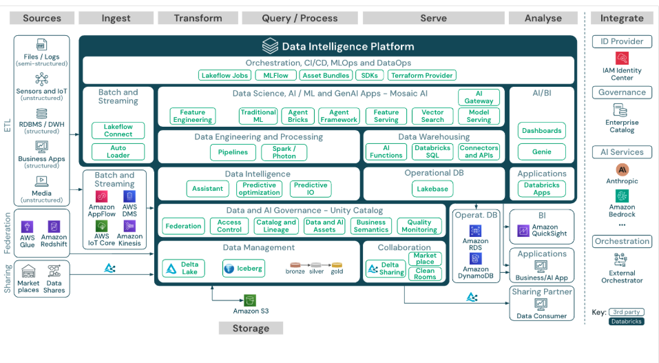

# Databee Internship 2026 — Session Notes

> Sessions are ordered **latest first** — most recent session at the top.

---

## Session 4 — April 11, 2026 *(upcoming)*

**Attendees:**

**Agenda:**

**Part 1 — Carried over from Session 3**
1. Week check-in — what did you work on? Blockers? Wins?
2. Parquet deep dive — why is it the backbone of big data?
3. Code sharing — Stage 1 progress; screen share what you have built so far
4. Architectural discussion — table formats (Delta, Iceberg, Hudi) deep dive and comparison; Lakehouse vs Data Lake vs Data Warehouse

   
5. Deepika demo — CI/CD pipeline with GitHub Actions + Databricks *(whenever ready)*

**Part 2 — Based on midweek sync (Apr 8)**
- Git workflow recap — quick walkthrough of feature branch → PR flow
- Data sources Q&A — clarify what datasets to use per stage (Faker, Kaggle, CoinGecko API, Raspberry Pi IoT simulator)
- Catch up with Filip & Nikolaos — hear about their progress and see if there is anything the group can help with

**Notes:**

*(To be filled after session)*

---

## Session 3 — April 4, 2026

**Attendees:** Sanjeev Kumar (mentor), Kousalya (organizer), Suhash Raja, Filip Cedermark, Asindu Gayangana, Elliot Eriksson, Deepika Elangovan, Nikolaos Biniaris

*Note: Easter weekend — some interns had limited availability; Filip left early.*

**Agenda:**
1. Repo walkthrough — structure, CLAUDE.md, branching strategy
2. Week check-in & platform check-in
3. Use case progress & live demos
4. Architectural discussion — file formats & table formats

**Notes:**

### 1. Repo Walkthrough

Sanjeev walked through the repo structure for interns who had just cloned it:

- `raw/` — raw inputs including meeting transcripts. Interns can commit their own midweek sync transcripts here as a progress tracker.
- `live/` — living documents (session notes, use cases, topics list). All interns have read/write access; suggest edits via PRs.
- `action/` — intern work artifacts. Each intern creates their own subfolder under their stream (e.g. `action/DE-DevOps/your-name/`). Treat it as a monorepo.
- `CLAUDE.md` — key config file for AI-assisted workflows. Changes should go through PRs, not direct commits to main.
- Branching strategy: `feature/*` → `dev` → `staging` → `main` (GitFlow lite). All interns should create feature branches and submit PRs.

---

### 2. Week Check-in & Platform Check-in

- **Suhash Raja** — Started SQL basics (DDL) in Databricks. Chose **Databricks** (free enterprise edition). Has not cloned the repo yet; plans to do so post-session.
- **Filip Cedermark** — Getting set up on Databricks; file structure setup was trickier than expected. Used ChatGPT to generate sample data and landed it in Databricks. Planning to look at Stage 2 (CDC) next. Sanjeev recommended switching to the **Faker library** for reusable, scalable data generation in Databricks.
- **Asindu Gayangana** — Built a pipeline in Databricks using a 5M-row Kaggle dataset. Used **Autoloader** for Bronze ingestion. Set up **Change Data Feed (CDF)** on the Bronze table — manually modified data via SQL, then extracted changed records using version history (max version). Loaded dimension tables; still needs to join the fact table for Silver. Also researched Spark internals: worker nodes, partitions, ideal partition sizes, on-heap memory (execution + storage). Could not fully understand off-heap memory.
- **Elliot Eriksson** — Read about Spark and PySpark; drew diagrams of how it works. Confirmed he's on the **ML track**. Planning to use VS Code + PySpark. Sanjeev pointed out ML platform options: Databricks (MLflow), Snowflake (Cortex), AWS (SageMaker), Azure ML.
- **Deepika Elangovan** — Created Databricks account (Azure free trial exhausted). Watching YouTube tutorials on data ingestion. Has an existing GitHub CI/CD repo. Sanjeev asked her to demo CI/CD pipeline to the group using GitHub Actions + Databricks integration. Also mentioned **Databricks Asset Bundles** and **Terraform** as tools to explore.
- **Nikolaos Biniaris** — Shared screen showing Databricks. Ingested CRM/ERP data (customers, products, sales + dimension data — 6 tables) using both Python and SQL notebooks. Chose not to partition at Bronze (no date columns; dates stored as strings). Researched partitioning in Databricks vs standard Spark. Asked about handling multiple source types (CSV + API) — Sanjeev showed how to build parallel Databricks workflow tasks for independent sources. Also asked about API ingestion; Sanjeev directed him to research **Spark UDFs** and their trade-offs.

---

### 3. Architectural Discussion — File Formats & Table Formats

**Structured vs Semi-structured vs Unstructured data:**
- **Unstructured** (images, binary blobs) — no schema, slowest to process.
- **Semi-structured** (JSON, XML) — schema loosely coupled (xsd for XML); can be processed without schema.
- **Structured** (tabular, Parquet, Delta) — schema tightly bound; fastest for engines to process.

**Open Source vs Proprietary formats:**
- Proprietary: Oracle, Teradata, Snowflake's internal formats — require licenses.
- OSS: Parquet, Delta, Iceberg, Hudi, Avro, ORC — free to use; any engine or platform can adopt them.
- Interview tip: being able to reference OSS technologies (Apache Spark, MLflow, Iceberg) rather than only vendor tools shows platform-agnostic depth.

**Object stores:** S3, ADLS, GCS — where all data lives as files (called "objects"). Bronze/Silver/Gold data all lives here.

**Parquet:**
- The bread and butter of the big data world. Columnar format. Foundation of almost every modern data platform.
- **Task for interns:** research *why* Parquet is so important and what problem it solves. Discuss in midweek sync.

**Open Table Formats — Delta, Iceberg, Hudi:**
- All three are built on top of Parquet but add a metadata layer.
- Key features added: ACID transactions, time travel, schema enforcement, versioning, upsert/merge support.
- Delta Lake: created by Databricks engineers, then open sourced. Liquid clustering is a Delta innovation, also open sourced.
- Iceberg and Hudi: alternative open table formats with similar capabilities.
- Discussion to continue next session with deeper comparison.

**Streaming source tip (for Suhash's question):**
- **Raspberry Pi Azure IoT Web Simulator** — free, browser-based tool that generates IoT data and writes to Azure IoT Hub. Can be pointed at Databricks Structured Streaming or ADF for practice with real streaming ingestion.

---

### Action Items for Next Session

| # | Task | Who |
|---|------|-----|
| 1 | Research why Parquet is the backbone of big data — come ready to discuss in midweek sync and Session 4 | All interns |
| 2 | Clone the repo; create your own folder under `action/` for your stream | All interns |
| 3 | Start Stage 1 (batch ingestion) in Databricks | Suhash |
| 4 | Switch data generation to Faker library; explore Stage 2 (CDC) | Filip |
| 5 | Complete Silver fact table join; commit code to `action/` folder | Asindu |
| 6 | Choose ML platform (Databricks / SageMaker / Azure ML); start ML use case | Elliot |
| 7 | Commit CI/CD demo (GitHub Actions + Databricks) to internship repo; explore Databricks Asset Bundles and Terraform | Deepika |
| 8 | Build parallel Databricks workflow (CSV + API sources); read about Spark UDFs and their trade-offs | Nikolaos |

---

## Session 2 — March 28, 2026

**Attendees:** Suhash Raja, Filip Cedermark, Deepika Elangovan, Neha Doda, Kousalya (organizer), Sanjeev Kumar (mentor), Vivek Prasad (mentor), Vinod (mentor), Asindu Gayangana, Nikolaos Biniaris, Elliot Eriksson

**Agenda:**
1. Week check-in — what did you work on? Anything to share?
2. Platform — use and registration
3. Use cases defined per stream
4. Architectural discussion

**Notes:**

### 1. Week Check-in

Interns shared what they worked on since Session 1:

- **Suhash + group** — Reviewed the shared presentation slides; had a midweek check-in among themselves to compare tools and skills.
- **Filip Cedermark** — Refreshed SQL fundamentals on HackerRank (basic and advanced queries). Also attended a Snowflake AI/agentic event (got in last-minute via a colleague's spare spot).
- **Deepika Elangovan** — Recapped SQL basics; had not used SQL since joining Accenture, so focused on getting back up to speed with small queries.
- **Asindu Gayangana** — Worked on SQL and PySpark; focused on window functions and complex joins. Subscribed to a Spark Playground for hands-on practice.
- **Nikolaos Biniaris** — Practised SQL heavily (window functions, joins). Asked a good question: *how much do we need to manage clustering ourselves in Snowflake vs Databricks?* Sanjeev explained predictive optimization — both platforms can auto-manage clustering, but Databricks gives manual control if needed.
- **Elliot Eriksson** — Limited prior experience with data lifecycle; had done minor data cleaning projects (null/duplicate removal) including a cancer-identification ML project.

Sanjeev's advice to the group: attend platform meetups (Databricks, AWS, Microsoft, Snowflake) beyond big paid events — look up smaller user groups and meetups on meetup.com.

---

### 2. Platform — Use and Registration

Sanjeev walked through how to choose a platform to implement the use cases:

- All major cloud platforms offer free/trial accounts: **Azure (ADF)**, **AWS (Glue)**, **Databricks (Lakeflow Designer / Serverless SQL — now unlimited free tier)**, **Snowflake**.
- Recommended approach — start easy, then go deeper:
  - **Phase 1:** Drag-and-drop tools (ADF, Glue, Lakeflow Designer) — implement the use case with minimal code to understand the concepts.
  - **Phase 2:** Re-implement the same use case in **pure PySpark** — this is the target skill for data engineers.
- Failures/errors encountered along the way will surface important Spark internals worth discussing in sessions.
- **Task:** Each intern to pick a platform, spin up a trial account, and report back next session which platform they chose.

---

### 3. Architectural Discussion

#### 1. Data Lifecycle
The journey every piece of data takes through a modern data platform:

- **Ingestion** — Pull raw data from source systems (databases, APIs, flat files, streams) and land it as-is into storage (Bronze layer). No transformation yet.
- **Cleaning** — Remove nulls, duplicates, invalid records. Standardize formats (dates, currency, casing). This produces a trusted, queryable Silver layer.
- **Transformation** — Apply business logic: joins, aggregations, KPI calculations, data modelling (Star Schema). This is the Gold layer — ready for consumption. dbt owns this step.
- **Serving** — Expose the clean, modelled data to end consumers: dashboards (Power BI / Tableau), APIs, ML models, or self-serve querying (Databricks Genie).

#### 2. Distributed Systems
Why we can't just use a single machine for large data:

- A single machine has limits on CPU, RAM, and disk — at scale, data doesn't fit
- Distributed systems split work across many nodes (computers) that work in parallel
- Key concepts: partitioning (splitting data), fault tolerance (handling node failures), coordination (who does what)
- Examples in the wild: Hadoop (HDFS), Kafka (streaming), Cassandra (NoSQL), and the Spark cluster itself
- The trade-off: more complexity, but linear scalability

#### 3. Distributed Engines
The processing layer that runs on top of distributed systems:

- **Apache Spark / PySpark** — The dominant batch + streaming engine. Processes data in-memory across a cluster. Used for Silver → Gold transformations at scale.
- **Apache Flink** — Real-time stream processing. Lower latency than Spark Streaming.
- **Databricks** — Managed Spark platform with optimizations (Delta Engine, Photon). What most enterprises run today.
- **dbt** — Not distributed itself, but pushes transformation logic down into the warehouse engine (Snowflake, BigQuery, Redshift) which is distributed underneath.

#### 4. File Formats
How data is physically stored on disk — this matters for performance:

| Format | Type | Pros | Best For |
|---|---|---|---|
| CSV | Row-based | Human readable, universal | Small files, quick sharing |
| JSON | Row-based | Flexible schema, API native | Raw ingestion, semi-structured data |
| Parquet | Columnar | Fast reads, great compression | Analytics, data warehouses |
| Avro | Row-based | Schema evolution, compact | Kafka streaming, Hadoop |
| Delta | Columnar + ACID | Versioning, time travel, ACID | Production pipelines (Databricks) |
| ORC | Columnar | Optimized for Hive/Hadoop | Legacy Hadoop stacks |

Key takeaway: **use Parquet or Delta for anything going into a pipeline**. CSV/JSON only at the ingestion boundary.

---

### 4. Use Cases Defined per Stream

Each intern now has a defined use case that will be their north star through the internship. These are end-to-end projects that build progressively each month.

**Sanjeev - DE**

**Use Case: Smart Retail Analytics & AI-Powered Recommendation Engine**

A retail company operates both online and offline stores. They receive raw data from multiple sources — transactional databases, REST APIs, and flat files — and need an end-to-end data platform to power business reporting, customer intelligence, and an AI-assisted product recommendation system.

**Data Sources:**
- Customer & Orders DB → PostgreSQL (OLTP) — ingested via Python + SQLAlchemy
- Product catalog → REST API (paginated JSON) — ingested via Python Requests
- Store inventory & suppliers → CSV files (daily drops) — processed via Pandas / PySpark
- User clickstream / behavior → JSON logs — processed via PySpark

**Pipeline Stages:**

- **Stage 1 — Extract (Bronze):** Ingest from all sources into cloud storage (S3/Azure Blob), partitioned by ingestion date. Raw data stored as-is.
- **Stage 2 — Silver (Cleaning & Enrichment):** Remove nulls, duplicates, invalid records. Standardize timestamps and currency. Join orders → customers → products. Deduplicate using SQL Window Functions (ROW_NUMBER). Use CTEs for readable transformation logic.
- **Stage 3 — Data Modeling:** Design a Star Schema (fact_orders + dim_customer, dim_product, dim_date, dim_store). Load into a cloud warehouse (Snowflake / BigQuery / Redshift).
- **Stage 4 — Gold Layer with dbt:** Build dbt models for business metrics — revenue by product, customer lifetime value, customer segments (High/Mid/Low), store performance, inventory health. Add dbt tests (not_null, unique, custom SQL).
- **Stage 5 — Scale with PySpark:** Re-implement Silver → Gold transformations in PySpark. Handle millions of rows with partitioning, caching. Compare Pandas vs PySpark for scale.
- **Stage 6 — Orchestration with Airflow:** Daily DAG at 10 AM — extract → silver → gold → dbt run → notify. Add retry logic, failure alerts, backfill support, data quality sensor tasks.
- **Stage 7 — AI Layer (RAG + Vector DB):** Embed product descriptions → store in Pinecone or pgvector. Build a RAG pipeline for semantic product search and personalized recommendations using purchase history.
- **Stage 8 — CI/CD & Production Hardening:** GitHub Actions pipeline (lint → test → staging → prod). Environment-based dbt profiles. Bash scripts for health checks and backfills. Full documentation and architecture diagram.

**Approach 1 — Cloud Native:** Python → S3/Azure Blob → Snowflake/BigQuery → dbt → Airflow → pgvector/Pinecone → GitHub Actions

**Approach 2 — PySpark Stack:** Python + PySpark → Parquet/HDFS → PostgreSQL or Databricks → dbt → Airflow (local) → pgvector → GitHub Actions

**Vinod - DA**

SQL Internship - Setup and Week 1 Tasks

1. SQL Setup Steps
   - Install Microsoft SQL Server 2019 Developer Edition.
   - Install SQL Server Management Studio (SSMS).
   - Download the AdventureWorks sample database backup file (.bak).
   - Open SSMS and connect to the SQL Server instance.
   - Right click on Databases and select Restore Database.
   - Choose Device and select the downloaded .bak file.
   - Complete the restore process and create the database.
   - Run a sample query to confirm the setup is working.

2. Week 1 SQL Practice Questions
   - Get all records where FirstName starts with A and ends with n
   - Find people whose LastName length is more than 6 characters
   - Get records where FirstName contains ar but not at the start
   - Fetch records where FirstName is exactly 5 characters long
   - Find people where FirstName is equal to LastName
   - Get records where FirstName has no vowels
   - Find people whose LastName starts with same letter as FirstName
   - Get records where FirstName starts with M and LastName ends with r
   - Find people where FirstName starts with J or LastName starts with S but BusinessEntityID is less than 100
   - Get records where FirstName contains a and does not contain e
   - Find people where FirstName starts with A or B and LastName contains son
   - Find names where second letter is a
   - Find names where third letter is r
   - Get names where FirstName starts and ends with same letter
   - Find names that contain exactly one a
   - Get names that contain at least two a characters
   - Find records where FirstName is in John, David, Mary and BusinessEntityID is between 50 and 200
   - Get records where FirstName is not in James, Robert and LastName starts with B
   - Find people where BusinessEntityID is between 10 and 100 and FirstName starts with a vowel
   - Get records where ID is between 1 and 300 but exclude even numbers
   - Find people where FirstName starts with S and LastName ends with n or contains ar
   - Get records where FirstName starts with a vowel and LastName does not start with a vowel
   - Find people where FirstName length is greater than 5 and LastName length is less than 5
   - Get records where FirstName contains a and LastName contains e and BusinessEntityID is less than 150
   - Find people where FirstName starts with A or LastName ends with e and FirstName does not contain z and BusinessEntityID is between 10 and 200
   - Find people where FirstName has exactly two vowels and LastName starts with same letter as FirstName and ID is not between 50 and 100
   - Find people where FirstName contains ar only once and LastName length is greater than FirstName length

**Vivek - ML**
TBU

---

### Action Items for Next Session

| # | Task | Who |
|---|------|-----|
| 1 | Read about distributed systems, distributed engines, and file formats. Prepare an architecture diagram of how Spark works (driver, workers, partitioning, fault tolerance) — explain it to the group. | All interns |
| 2 | Sign up for a trial platform of your choice (Azure/AWS/Databricks/Snowflake). Report back which platform you chose. | All interns |
| 3 | Start on Stage 1 of your assigned use case using the chosen platform. | DE / DevOps interns |
| 4 | Sanjeev to refine the use case document and share the repo with the group. | Sanjeev |
| 5 | Sanjeev to update DevOps and ML use case sections. | Sanjeev |
| 6 | Continue midweek check-in among yourselves. Drop blockers/questions in Slack. | All interns |

---

## Session 1 — March 21, 2026

**Attendees:** Sanjeev Kumar (mentor), Suhash Raja, Filip Cedermark, Deepika Elangovan, Neha Doda, Kousalya (organizer)

**Agenda:**
1. Introductions (experience, expectations, fun fact)
2. Structure of sessions — discussion
3. Common session plan for all streams

**Notes:**

Session structure agreed:
- Saturday 1-hour sessions (mentors unavailable on weekdays)
- First month: common sessions for all streams covering foundational topics
- 4 streams planned: DA, DE, DevOps/Infra, ML/Analytics

Intern introductions & stream assignments:

- **Suhash Raja** — Major: DE + DevOps. 10 yrs IT (PL/SQL, Splunk, Docker, Terraform, GitHub Actions). Databricks Associate certified.
- **Filip Cedermark** — Major: Data Engineering. Vocational AI/ML school, 17-week internship at Postnode (PySpark/Databricks), consulting bootcamp.
- **Deepika Elangovan** — Major: DE + DevOps. 4 yrs DevOps at Accenture (Azure, CI/CD, Terraform, Kubernetes). Wants to expand into DE.
- **Neha Doda** — Major: DA (primary), interested in DA + DE combo. Power BI, PL-300 certified (Jan 2026), end-to-end BI background.

Key discussion points:
- AI philosophy: build foundational knowledge first, use AI as a companion — not vibe-coding from day one
- AI impact on DA roles discussed (Databricks Genie/AI BI); Neha's DA + DE combo recommended as a strong skillset
- Vinod (mentor) intro not completed — transcript cut off
